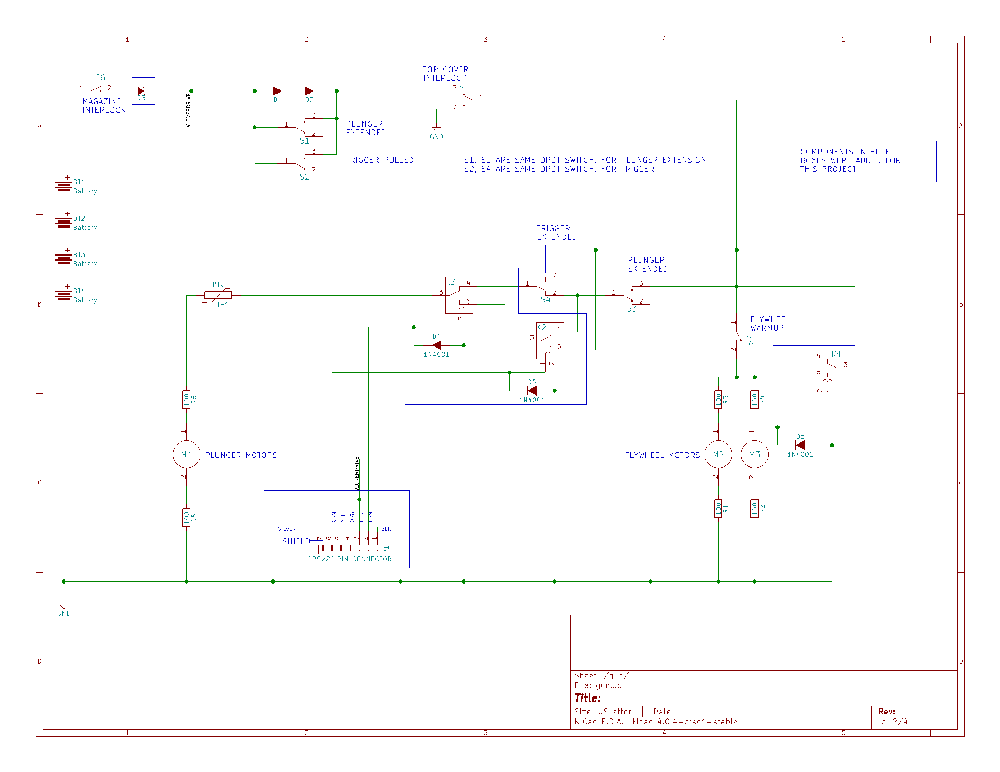
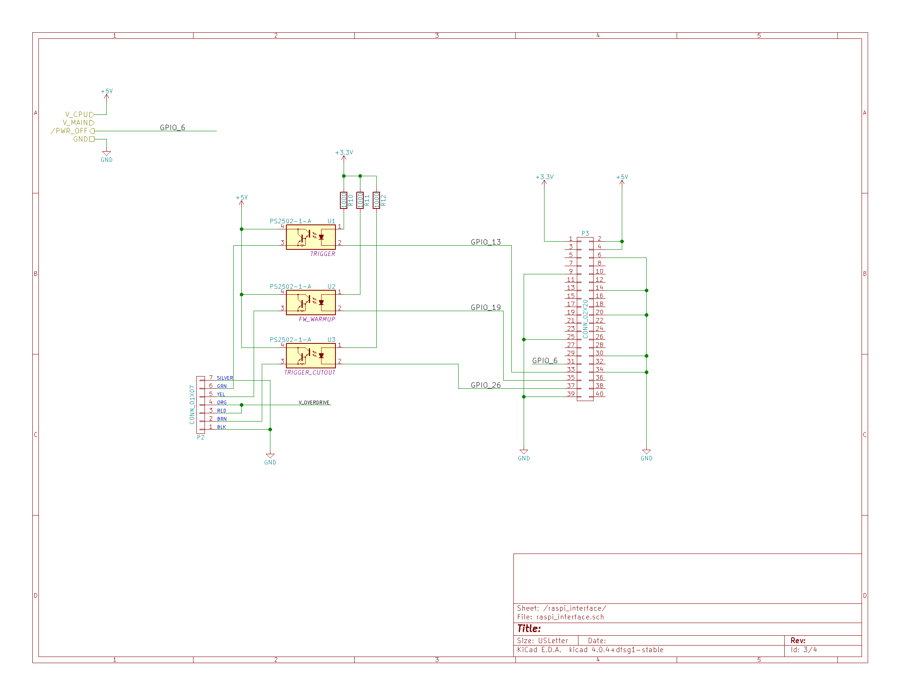
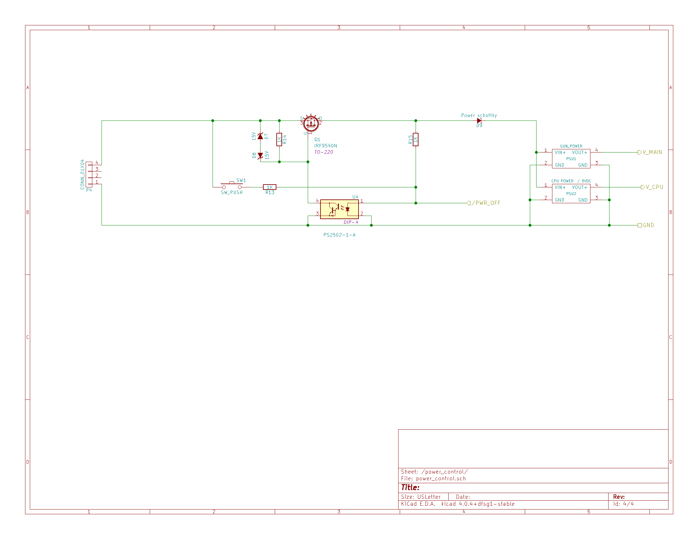

~~~~
  _____ _______ _____   _   _   _____   
 / ____|__   __|_   _| | \ | | / ____|  
| (___    | |    | |   |  \| || |  __   
 \___ \   | |    | |   | . ` || | |_ |  
 ____) |  | | _ _| |_ _| |\  || |__| |_
|_____(_) |_|(_)_____(_)_| \_(_)_____(_)

  Sturdy Tactical Integrated Nerf Gun
~~~~

[https://sturdy.cloud/sting]([https://sturdy.cloud/sting])

  - [The Gun](#the-gun)
    - [Design Goals](#design-goals)
    - [Nerf Gun Internals](#nerf-gun-internals)
      - [Mechanical](#mechanical)
      - [Electronics](#electronics)
      - [Circuit Description, and Modifications](#circuit-description-and-modifications)
        - [Batteries](#batteries)
        - [Flywheel Idle Speed Controller](#flywheel-idle-speed-controller)
        - [Top Cover interlock](#top-cover-interlock)
        - [Flywheels and Flywheel Warmup](#flywheels-and-flywheel-warmup)
        - [Trigger and Plunger control](#trigger-and-plunger-control)
        - [External Interface](#external-interface)
  - [The Controller](#the-controller)
    - [Components](#components)
      - [Raspberry Pi 3 + Raspberry Pi Camera](#raspberry-pi-3--raspberry-pi-camera)
      - [Interface board](#interface-board)
      - [Power Control and Power Supplies](#power-control-and-power-supplies)
    - [Software](#software)
      - [Operating system](#operating-system)
      - [Python 2.7](#python-27)
      - [OpenCV + imutils](#opencv--imutils)
      - [Rekogntion from Amazon Web Services](#rekogntion-from-amazon-web-services)
      - [STING](#sting)
        - [The Sting Low Level Library](#the-sting-low-level-library)
        - [The Sting GUI](#the-sting-gui)
      - [Software Miscellaneous](#software-miscellaneous)
  - [Copyright](#copyright)

## The Gun

Choosing the correct gun for this project was important.  It required that the gun be fully automatic in operation, and could be actuated electrically.  After a bit of web searching, one particular model stuck out as being "mod friendly"; the [Nerf CS-18 N-Strike Elite Rapidstrike](https://www.google.com/search?q=Nerf+CS-18+N-Strike+Elite+Rapidstrike&oq=Nerf+CS-18+N-Strike+Elite+Rapidstrike&aqs=chrome..69i57j69i61.820j0j7&sourceid=chrome&ie=UTF-8).  One video in particular, [How to Modify the Nerf Rapidstrike CS-18](https://www.youtube.com/watch?v=sphHIFf8-Mc) by Youtuber Coop772 was very helpful.

This gun has a separate button to bring the flywheels up to speed.  This button must be pressed before pulling the main trigger; a mechanical interlock prevents the main trigger from actuating if the flywheel button is not being held.

### Design Goals
There were several design decisions that made this project a bit harder:

* Gun should still operate normally when not being controlled
* Gun could be powered externally even when the batteries are installed
* Gun could be "overpowered" externally to shoot faster and farther.

### Nerf Gun Internals

#### Mechanical
The mechanical portion of the gun was fairly straight-forward. No real surprises.  

There's a flywheel assembly that has two motors, each with their own flywheel. These motors turn in opposite direction, and operate by gripping and flinging a Nerf dart that is pushed into the rear of the assembly.

The other major assembly is the plunger assembly.  It simply pushes darts into the flywheel assembly when the trigger is pushed.

#### Electronics

The actual electronics are fairly simple in the _parts_ used (switches, motors, diodes, etc), but more complex than anticipated in their design.  Not _overly_ complex since, as we'll see, every bit is necessary.

The modifications internally mostly involved gluing 3 relays on top of the plunger unit, and doing point-to-point wiring to connect them to the proper points in the existing circuitry.

#### Circuit Description, and Modifications

Nerf Gun Schematic

Refer to the Nerf Gun Schematic, above.  The components in side the blue lines were added; everything else is part of the original gun.

##### Batteries

The gun is nominally powered by 4 C batteries. After modification, this is still true (see [Design Goals](#design-goals)), but D3 (a power Schottky) has been added so that any applied external voltage would not back-feed into the batteries.  

In the event that the dart magazine is not inserted S6 opens, removing battery power for the gun.  You can see after D3 is where the V_OVERDRIVE (external power) enters the circuit, thus when the gun is externally powered, the magazine interlock is defeated.

##### Flywheel Idle Speed Controller

Diodes D1, D2 provide a voltage dropper so that the flywheels will spin at a lower speed when not actively firing.  While pressing the trigger (or during active plunger movement) switches S1, S2 bypass the diodes, allowing the flywheels to spin at full speed.  

It's important to note that on the schematic switches S1 and S3 are physically actually a single DPDT switch, as are S2 and S4.  S1/S3 are switched by pulling the trigger, and S2/S4 are switched whenever the plunger mechanism is not in the "idle" position.

##### Top Cover interlock

S5 switches to the lower position when the top cover of the gun is open.  This works a bit differently from the magazine interlock in that it actually shorts in the power going to the motors to the circuit ground; this has the effect of quickly braking any moving motors, for safety purposes.

##### Flywheels and Flywheel Warmup

The flywheel is normally spun up by S7, which is an external button on the gun for just this purpose.  When controlling the gun externally, K1 is actuated in order to bypass S7 and spin up the flywheels.  Diode D6 is to suppress any voltage spike occurring when K1 de-energizes.

The flywheels themselves are simply two small DC motors with the flywheels mounted on their shafts. Resistors R1-R4 provide current limiting.

##### Trigger and Plunger control

Under normal operation, when you pull the trigger, then the plunger assembly begins operating.  The plunger is a simple plastic rod (attached to a gearing mechanism and a small motor) that will extend to push a dart into the flywheel, then retract and (if the trigger is still pulled), extend to fire the next dart.

Let's ignore the modifications (K2, K3) for a bit, and focus on how the gun works without them:

The trigger is represented in the schematic by S4, which applies power to the plunger assembly when pulled.  The question is "what happens to the plunger when you let go of the trigger while it's extended?"  Normally, the plunger would immediately stop, but you'd want the plunger to always return to the "home" position, regardless of what the operator is doing.  That's the purpose of S3, which is in the "PLUNGER EXTENDED" position anytime the plunger is (you guessed it) extended.  This allows power to continue to flow into the plunger motor when the plunger is extended, even if the trigger has been released.  When the plunger returns to the "home" position, and the trigger is _not_ pulled, then the plunger stops, as S3 moves to the lower position, and grounds the motor, causing it to brake.

Lets get back to the modifications.  Relay K2 operates identically to how K1 does in that it bypasses S4 (the trigger switch); note that we're using both poles of K2, just as both poles of S4 are used.

Relay K3 is there as a "bypass" to enable K2 to work correctly.  It "selects" K2 instead of S4. Without K3 (imagine K2 pin 3 hooked to S4 pin 1), it's possible for K2 to short the power supply (K2 pin 5 --> K2 pin 3 --> S4 pin 1 --> S4 pin 2 --> S3 pin 1 --> S3 pin 2).  With K3, S4 is "cut out" of the circuit, but S3 still operates normally.  In practice, K3 _must_ be actuated before K4.  This is enforced in software.

##### External Interface

Connector P1 is a 6-pin DIN connector.  Some readers might remember this as being the same physical connector as used on PS/2 mice and keyboards. A PS/2 extender cable was cut in half.  The female half was installed in the gun, physically placed into the rear sight.  The male half was connected to the control electronics.

Wiring is straight-forward.  Pins 1 and the shield are used for ground, while pins 3 and 4 for external power.  The pins were doubled up to increase the current capacity of the small gauge wire.  

The rest of the pins are used to directly power the 3 relays described above.

## The Controller

The controller sits atop the gun.  The controller uses a camera and facial recognition to locate "enemies" and then decide to fire the gun or not.

### Components

#### Raspberry Pi 3 + Raspberry Pi Camera

The main CPU is a stock Raspberry Pi 3.  Chosen for it's ease of use, available software libraries.  It's coupled with an Adafruit [2.8" PiTFT display](https://www.adafruit.com/products/2298), and enclosed in an Adafruit [enclosure](https://www.adafruit.com/product/2285) and [faceplate](https://www.adafruit.com/products/2807).  

The camera module is the standard Pi (camera)[https://www.raspberrypi.org/products/camera-module/] version 1.3, with an Adafruit [Pi Camera Board Case](https://www.adafruit.com/products/3253), and a 15cm ribbon cable, since the stock cable is too short.

#### Interface board

The interface board bridged together the Raspberry Pi, the input power from the power supplies and power control board, and the gun itself.

At the upper left of the schematic is where the power supplies are connected to the board.  V_CPU is +5v to power the Raspberry Pi.  V_MAIN is the external power for the gun itself.  /PWR_OFF is an output signal that allows the Pi to turn off the power supplies; active low.  

In the center of the schematic there are 3 opto-couplers (P/N PS2502-1-A).  These are used to switch power to the relays inside the gun.  Resistors R10, R11, R12 provide current limiting for the opto-coupler input diode.  The opto-couplers are connected to the Pi via GPIO pins 13, 19, and 26.  These were chosen so as to not interfere in the pins used by the LCD screen, which is also attached to the Pi GPIO port.

Physically, the interface board is a [MakerSpot Pi Zero prototyping PCB](http://makerspot.com/prototyping-board-for-raspberry-pi-zero/).  This was used because of it's small size, and ability to connect to the Pi GPIO port.  The components are point-to-point wired onto the board.  

Because of the limited physical space inside the Pi case, the board itself mounted next to the GPIO extension port found on the back of the LCD; it is sandwiched between the LCD and the Pi main board. Small jumper wires are used to connect the GPIO to the board input itself. Only the necessary wires (ground, 5V, 3.3V, and pins 13, 19, and 26) are connected, as hand-wiring all 40 connectors would have been tedious and unnecessary.

The cables for the power input and the DIN cable for the gun are simply soldered to the board. The case has slots cut so that the wires may exit without being threaded through holes.

#### Power Control and Power Supplies

The power control board is designed to allow the Pi to turn itself off, since the Pi itself doesn't have any sort of on-board power control.

Let's start with the power supplies themselves, since this is the simplest part.  The gun was designed to be powered by 8-14VDC, mostly so that it could be powered by a 3S lithium polymer battery.  Since the Pi runs on 5VDC, and the gun electronics runs on about 7V, two buck buck power supplies are used, PSU1, and PSU2. These are your garden-variety LM2596 modules that are easily found on [Amazon](https://www.amazon.com/gp/product/B01GJ0SC2C/ref=oh_aui_search_detailpage?ie=UTF8&psc=1) or [Ebay](http://www.ebay.com/sch/i.html?_from=R40&_trksid=p2050601.m570.l1313.TR12.TRC2.A0.H0.Xlm2596.TRS0&_nkw=lm2596&_sacat=0).  PSU2 is set at 5V, while PSU1 can be adjusted to 'overpower' or even 'underpower' the gun itself.  Underpowering only works when the gun's normal batteries are removed.

Moving on, the remainder of the circuit is a simple latching power switch implemented using an IRF9540N power P-channel MOSFET. When the power is off, the gate of Q1 is held at the same voltage as it's source, switching it off.  When the user presses S1, this powers on U4, which brings the gate of Q1 nearly to ground, causing it to conduct. R15 then keeps U4 energized, keeping the power on.

Upon shutdown, the Pi brings the /PWR_OFF line low, cutting power to U4, and Q1 then stops conducting.

Diode D9, a power Schottky prevents the input capacitors of PSU1 and PSU2 from back-feeding and re-energizing U4 when the power is shut off.

The power control board is built on a piece of standard solderable prototyping board.

### Software

#### Operating system

[Raspbian Jessie](https://www.raspberrypi.org/downloads/raspbian/), the nearly ubiquitous choice for the Pi.

#### Python 2.7
Python for rapid and easy development.  [Virtualenv](https://virtualenv.pypa.io/en/stable/) and [virtualenvwrapper](https://virtualenvwrapper.readthedocs.io/en/latest/) were used to create a custom Python environment, which allowed for compiling the OpenCV module from source without much hassle.

#### OpenCV + imutils

[OpenCV](http://opencv.org/) was compiled from source, using the excellent [tutorial](http://www.pyimagesearch.com/2015/10/26/how-to-install-opencv-3-on-raspbian-jessie/) found on [piimagesearch](http://www.pyimagesearch.com/). It wasn't certain this step was necessary at first, but the compiled OpenCV has considerably better performance than the stock `python-opencv` package available in Jessie.

[imutils](https://github.com/jrosebr1/imutils) made it really easy to grab frames from the Pi camera.

#### Rekogntion from Amazon Web Services

[Rekogntion](https://aws.amazon.com/rekognition/) is used to recognize and persist faces; it forms the core of the "Identify Friend or Foe" portion of the software.

#### STING

[STING](https://github.com/sturdycloud/sting) (Sturdy Tactical Integrated Nerf Gun) is the code that ties everything together.

There are two main components: The `sting` Python library (low level hardware control of the gun), and the `gui` script, which does the heavy lifting of using OpenCV, Rekognition, and managing the guns GUI.

##### The Sting Low Level Library

The Sting library consists of a single `Sting` class.  It's purpose is to manage the Pi's physical interface to the Nerf gun via the GPIO port.  This class implements a context manager via the `with` Python keyword.  This allows the library to do proper setup and teardown of the GPIO.  If used outside of the `with` statement, a RuntimeError will be generated.  

This library is designed to be simple to use.  An instance exposes 3 main boolean properties: `cutout`, `flywheel`, and `trigger`, which represent the cutout, flywheel and trigger relays (described above), respectively.  Setting any of these properties to `True` will energize that particular relay, while setting them to `False` de-energizes that relay.

The code enforces correct statefulness of the relays so that setting `trigger` to `True` will ensure that `cutout` and `flywheel` are also `True`, and will de-assert them if trigger is subsequently set to `False`, but only if they were engaged automatically.

The simplest use case is:

    sting = Sting()
    with sting:
        sting.trigger = True
        time.sleep(5)
        sting.trigger = False

##### The Sting GUI

The GUI is the most complicated part of the STING system.  Here's a basic breakdown of it's operation, in highly simplified pseudocode:

    while running:
      getVideoFrame()
      findFacesinFrame()
      drawBoxesAroundFaces()
      isEnemy = submitFacesToRekognition()
      if isEnemy and weaponEnabled:
        fireGun()
      showVideoFrame()
      checkButtonsAndUpdateMenus()

#### Software Miscellaneous

* Power control is achieved using a Device Tree Overlay, specifically the gpio_poweroff overlay.  This is implemented by adding the following line to the end of the `/boot/config` file on the Pi:

`dtoverlay=gpio-poweroff,gpiopin=6,active_low="y"`

* Use of the PiTFT screen means installing a custom Linux kernel from Adafruit.  This is pretty straight-forward (especially using the "[easy install](https://learn.adafruit.com/adafruit-pitft-28-inch-resistive-touchscreen-display-raspberry-pi/easy-install)" method), but _do not_ allow this script to set up one if the physical buttons as an "on off" switch, as this overrides the kernel hook used by gpio_poweroff.

* To make the software auto-start in X, add gui.py to /home/pi/.xsession to start up

* To allow the script to restart the gun, sudo chown root.root gui.py && sudo chmod 4755 gui.py

# Copyright
Sturdy Tactical Integrated Nerf Gun  
Copyright 2017, Sturdy Networks, LLC

This program and all accomplying documentation and schematics is free
software; you can redistribute it and/or modify it under the terms of
the GNU General Public License as published by the Free Software Foundation;
either version 2 of the License, or (at your option) any later version.

This program is distributed in the hope that it will be useful,
but WITHOUT ANY WARRANTY; without even the implied warranty of
MERCHANTABILITY or FITNESS FOR A PARTICULAR PURPOSE.  See the
GNU General Public License for more details.

You should have received a copy of the GNU General Public License along
with this program; if not, write to the Free Software Foundation, Inc.,
51 Franklin Street, Fifth Floor, Boston, MA 02110-1301 USA.
